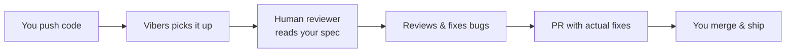

<p align="center">
  
</p>

<h1 align="center">Vibers — Human-in-the-Loop Code Review</h1>

<p align="center">
  <strong>AI writes the code. We check if it actually works.</strong>
</p>

<p align="center">
  <a href="https://github.com/marsiandeployer/human-in-the-loop-review/stargazers"></a>
  <a href="https://github.com/marsiandeployer/human-in-the-loop-review/blob/main/LICENSE"></a>
  <a href="https://github.com/marsiandeployer/human-in-the-loop-review/issues"></a>
  <a href="https://github.com/marsiandeployer/human-in-the-loop-review/pulls"></a>
  <a href="https://github.com/apps/vibers-review/installations/new"></a>
</p>

<p align="center">
  <a href="https://onout.org/vibers/">Website</a> &bull;
  <a href="https://onout.org/vibers/blog/">Blog</a> &bull;
  <a href="https://onout.org/vibers/SKILL.md">AI Agent Skill</a> &bull;
  <a href="docs/WIKI.md">Wiki</a> &bull;
  <a href="https://t.me/VibersReview">Telegram</a> &bull;
  <a href="https://www.reddit.com/r/VibeCodeReview">Reddit</a>
</p>

---

You vibe code fast with Cursor, Copilot, or Claude Code. Then spend 3x longer debugging things you didn't write.

**Vibers** puts a human in the loop. We review your AI-generated code, catch the bugs AI misses, fix them, and send you a PR. You merge and keep shipping.

> **Honest about what this is:** We're not a security firm. No OWASP pentests, no architecture deep-dives. We're regular devs who review your code with fresh eyes — catch obvious bugs, check that main flows work, write the fix. Think alpha tester who sends a PR instead of filing a ticket.

## Quick Start (30 seconds)

### Option A: AI Agent (recommended)

Tell your AI coding agent:

```
Install skill from https://onout.org/vibers/SKILL.md
```

Works with Claude Code, Cursor, Windsurf, and Codex.

### Option B: GitHub App (one click)

[](https://github.com/apps/vibers-review/installations/new)

1. Click the button above
2. Select your repositories
3. Push code with a "How to test" section in your commit message
4. Get a PR with fixes within 24 hours

### Option C: GitHub Action

```yaml
name: Vibers Review
on: [push]
jobs:
  review:
    runs-on: ubuntu-latest
    steps:
      - uses: actions/checkout@v4
      - uses: marsiandeployer/vibers-action@v1.1
        with:
          spec_url: 'https://docs.google.com/document/d/YOUR_SPEC'
          telegram_contact: '@your_telegram'
```

## What We Catch

| Category | What we look for |
|----------|-----------------|
| **Spec compliance** | Does the code actually do what you described in your spec? |
| **AI hallucinations** | Fake APIs, non-existent imports, fabricated npm packages |
| **Logic bugs** | Edge cases, null handling, off-by-one errors, broken flows |
| **UI/UX issues** | Broken layouts, missing loading states, wrong behavior |
| **Security gaps** | Hardcoded secrets, open CORS, missing auth checks |

## How It Works

```
You push code → Vibers notifies reviewer → Human reviews against your spec → PR with fixes → You merge
```



## Real Review Example

Here's a real PR we sent to [MethasMP/Paycif](https://github.com/MethasMP/Paycif) — a payment gateway from Thailand:

> **[PR #2: Bug fixes and improvements](https://github.com/MethasMP/Paycif/pull/2)** — Found 5 bugs including broken payment flow, missing error handling, and UI issues. All fixed with working code.

Recent UI example from the landing page: on a mobile floor map, both the desktop slot label and the short mobile label rendered at once, causing unreadable overlap. Vibers turned that into a concrete fix prompt and a clean before/after result.

This is what every review looks like: not just comments, but actual working fixes in a PR.

## Landing Page Examples

Landing page case studies now live in [`docs/examples/`](docs/examples/README.md) and render on the site as an expandable examples list.

Each example should keep the same structure:

- short title + one-sentence bug summary
- before screenshot
- after screenshot
- English prompt that could realistically produce the fix
- optional proof link: PR, commit, issue, or live page

Current cases are the mobile floor map label fix, the Paycif mobile pricing card fix, a chat message wrapping fix for long conversation bubbles, a responsive poster preview loading fix, a floor map edge-slot alignment fix on mobile, and a Brand identity Screen 1/1 orientation fix in Stand settings.

When a UI bug is intermittent or stops reproducing later, we keep the exact screenshot or page link in the example so the case still points to the concrete screen where the issue was observed.

On the landing page, each case now stays collapsed behind its own downward arrow by default, using the same smaller type scale as the rest of the site so the section can grow without turning into a long wall of screenshots. Mobile UI captures inside the examples accordion are intentionally shown at a smaller, phone-like size so they read like interface previews instead of oversized posters.

Brand assets now use `assets/vibers-logo-source.jpg` as the source file for README, favicon, share previews, and the remaining internal page headers so the repo and site stay in sync.

For quick synthetic inspector screenshots, `demo/visual-bug.html` contains a deliberately exaggerated action-button bug where the label spills outside a fixed-width button body, and `demo/visual-fix.html` shows the corrected state. Run `scripts/build-demo-store-assets.sh` to regenerate the full captures plus the single side-by-side before/after banner assets `demo/chrome-store-before-after-640x400.png` and `demo/chrome-store-before-after-1280x800.png` for Chrome Web Store uploads.

## CMS Marketplace Hubs

We ship a SimpleReview module/extension to every major CMS marketplace. Each CMS gets a dedicated landing hub at `https://onout.org/[cms]/` with an animated 28s SimpleReview demo banner targeted at that platform's storefront/admin, plus deeper fix-and-customize articles.

| CMS | Hub | Deep article(s) | Marketplace target |
|-----|-----|-----------------|---------------------|
| WordPress | [/wordpress/](https://onout.org/wordpress/) | [How to fix and improve WordPress sites](https://onout.org/wordpress/how-to-fix-and-improve-wordpress-sites/) + 9 specific bug articles | WordPress Plugin Directory |
| 1С-Битрикс | [/bitrix/](https://onout.org/bitrix/) | [How to fix and customize Bitrix sites (RU)](https://onout.org/bitrix/how-to-fix-and-customize-bitrix-sites/) | 1С-Битрикс: Маркетплейс |
| Magento 2 | [/magento/](https://onout.org/magento/) | [How to fix Magento 2 issues](https://onout.org/magento/how-to-fix-magento-2-issues/) | Adobe Commerce Marketplace |
| Joomla 5 | [/joomla/](https://onout.org/joomla/) | [How to fix Joomla issues](https://onout.org/joomla/how-to-fix-joomla-issues/) | Joomla Extensions Directory (JED) |
| PrestaShop | [/prestashop/](https://onout.org/prestashop/) | [How to fix PrestaShop issues](https://onout.org/prestashop/how-to-fix-prestashop-issues/) | PrestaShop Addons |
| CS-Cart | [/cs-cart/](https://onout.org/cs-cart/) | [How to fix and customize CS-Cart](https://onout.org/cs-cart/how-to-fix-and-customize-cs-cart/) | CS-Cart Marketplace |
| Webasyst (Shop-Script) | [/webasyst/](https://onout.org/webasyst/) | [Доработка Shop-Script (RU)](https://onout.org/webasyst/how-to-fix-and-customize-shop-script/) | Webasyst Store |
| OpenCart | [/opencart/](https://onout.org/opencart/) | [How to fix OpenCart issues](https://onout.org/opencart/how-to-fix-opencart-issues/) + [Edit OpenCart without a developer](https://onout.org/opencart/edit-opencart-without-developer/) | OpenCart Extension Store |
| Shopware 6 | [/shopware/](https://onout.org/shopware/) | [How to fix Shopware 6 issues](https://onout.org/shopware/how-to-fix-shopware-6-issues/) | Shopware Store |
| Drupal 10/11 | [/drupal/](https://onout.org/drupal/) | [How to fix Drupal issues](https://onout.org/drupal/how-to-fix-drupal-issues/) + [Hire Drupal developer or use SimpleReview](https://onout.org/drupal/hire-drupal-developer-or-use-simplereview/) | drupal.org/project/ |

### Language routing and sitemap checks

English CMS hubs are canonical on `https://onout.org/[cms]/`. Russian CMS hubs are canonical on `https://habab.ru/[cms]/` and are served by the habab Flask route from the sibling source file `/root/vibers/[cms]/index.ru.html`; do not publish RU canonical URLs as `https://onout.org/[cms]/index.ru.html`.

When adding a translated hub:

1. Add `/root/vibers/[cms]/index.html` with `lang="en"`, canonical/OG/JSON-LD URL `https://onout.org/[cms]/`, and hreflang `en` + `x-default` to onout.
2. Add `/root/vibers/[cms]/index.ru.html` only when the RU page is ready, with `lang="ru"`, canonical/OG/JSON-LD URL `https://habab.ru/[cms]/`, hreflang `ru` to habab, and hreflang `en`/`x-default` to onout.
3. Register the RU file in `/root/space2/hababru/src/backend/routes/main_routes.py` via `VIBERS_CMS_PAGES`.
4. Regenerate the live onout sitemap from nginx-served routes: `timeout 30s scripts/generate-onout-sitemap.py`.
5. Run `timeout 30s scripts/lint-cms-hubs.py` and, after deploy/restart, `timeout 30s scripts/lint-cms-hubs.py --live`.

`https://onout.org/sitemap.xml` is served by nginx from `/root/vibers/generated/onout-sitemap.xml`, so new clean routes under `/root/vibers` must be added through `scripts/generate-onout-sitemap.py`. The old `/var/www/onout.org/sitemap.xml` belongs to the legacy static repo and is not the canonical public sitemap. `https://habab.ru/sitemap.xml` is generated by Flask and includes RU CMS canonical URLs from `VIBERS_CMS_PAGES`.

### Shared structure of each hub

Every `/[cms]/index.html` follows the same composition:

1. **Hero** — H1 with platform-specific value prop + Chrome Web Store CTA
2. **Animated banner** (28s cycle, `.sc-*` CSS classes) — cursor → extension icon → target element → SimpleReview popup → "Fix it" → recovered state + PR sidebar; auto-restart on scroll-in via IntersectionObserver
3. **What SimpleReview can fix** — 8 grid items, platform-specific (theme paths, hooks, language strings, etc.)
4. **How it works** — 4 steps adapted per platform (auto-detect mechanism, repo connection, click → PR)
5. **Comparison table** — freelancer/specialist hourly rate vs SimpleReview, 8 rows
6. **Use cases** — 4 personas (store owners, agencies, freelancers, non-tech)
7. **FAQ** — 6 Q&A mirrored in `FAQPage` JSON-LD (BlogPosting JSON-LD also present)
8. **CTA** — primary download + secondary [Vibers human review](https://onout.org/vibers/) for the 20% of work needing real human signoff
9. **Footer** — read-more links + brand attribution

Brand color is platform-specific (PrestaShop pink `#df0067`, Magento orange `#ee672f`, Drupal blue `#0678be`, etc.) but structural CSS is shared via the `/simple-review/` template.

### Source data + planning

- Keyword research per CMS: [`docs/keywords/*_broad-match_*_2026-04-30.csv`](docs/keywords/) (Semrush exports, 9 CMSs, ~250K total keywords)
- Article backlog: [`docs/keywords/cms-content-backlog-2026-04-30.md`](docs/keywords/cms-content-backlog-2026-04-30.md) (62 articles, Tier 1-3 by KD)
- CMS cluster articles are published one by one with source research and a page-specific SimpleReview animated banner; do not bulk-generate thin template pages.
- Master tracker: [Issue #66](https://github.com/marsiandeployer/human-in-the-loop-review/issues/66)
- Forum press releases for each CMS marketplace launch: [Issue #67](https://github.com/marsiandeployer/human-in-the-loop-review/issues/67)

## Vibers vs Alternatives

| Feature | Vibers | CodeRabbit | SonarQube | PullRequest.com |
|---------|--------|------------|-----------|-----------------|
| Reads your spec | Yes | No | No | Partial |
| Sends PRs with fixes | Yes | No (comments only) | No | No |
| Catches AI hallucinations | Yes | Partial | No | Yes |
| Tests live app | Yes | No | No | No |
| Setup time | 30 seconds | 5 min | Hours | Days |
| Free tier | Yes | Limited | Community | No |

## Pricing

| Plan | Price | Details |
|------|-------|---------|
| **Promo** | Free | Star this repo + share feedback. We review, fix, send a PR. |
| **Standard** | $15/hour | Priority turnaround, full spec review. Pay only for hours spent. |

No subscriptions. No contracts. No minimums.

## Who It's For

- **Solo founders** who vibecoded an MVP and want a sanity check before launch
- **Non-technical founders** who have a spec but can't read the code themselves
- **AI-first teams** where most code is AI-generated and nobody's reviewing it
- **Open source maintainers** getting AI-generated PRs they can't fully trust

## Community

- [Telegram Channel](https://t.me/VibersReview) — updates and case studies
- [Reddit r/VibeCodeReview](https://www.reddit.com/r/VibeCodeReview) — discussions and teardowns
- [Blog](https://onout.org/vibers/blog/) — articles on AI code quality, vibe coding, and review practices

## Promotion Notes

- [AI Chat Promotion Playbook](docs/ai-chat-promotion-playbook.md) — how to get Vibers and SimpleReview discovered in ChatGPT, Perplexity, Gemini, Grok, Claude, Copilot, and other AI answer engines.
- [Platform-specific forums](docs/WIKI.md#platform-specific-forums-for-community-placement-2026-04-30) — where to answer Shopify, Webflow, Bubble, WordPress, WooCommerce, Magento, OpenCart, PrestaShop, and similar platform threads without spam.

## FAQ

<details>
<summary><b>Do I need to share my spec?</b></summary>
Nope — it's optional. We read the code and figure out context. But a spec means faster, more targeted reviews.
</details>

<details>
<summary><b>What languages do you support?</b></summary>
JS/TS, Python, React, Next.js, Node.js, Django, Flask, Go. If it's on GitHub, we can review it.
</details>

<details>
<summary><b>How fast is the turnaround?</b></summary>
Within 24 hours. Standard plan gets priority.
</details>

<details>
<summary><b>What if I disagree with a fix?</b></summary>
Comment on the PR. We discuss, adjust, or explain. It's a conversation, not a decree.
</details>

<details>
<summary><b>Can you review private repos?</b></summary>
Yes. When you install the GitHub App, you choose which repos to share — including private ones. We only see what you explicitly allow.
</details>

<details>
<summary><b>No GitHub?</b></summary>
<a href="https://t.me/onoutnoxon">Write us on Telegram</a> and send your code + spec directly.
</details>

## Contributing

We welcome contributions! See [CONTRIBUTING.md](CONTRIBUTING.md) for guidelines.

Found a bug? [Open an issue](https://github.com/marsiandeployer/human-in-the-loop-review/issues/new).

## License

This project is licensed under the MIT License — see the [LICENSE](LICENSE) file for details.

---

<p align="center">
  <b>If this sounds useful — a star helps others find the project!</b>
</p>

<p align="center">
  <a href="https://github.com/marsiandeployer/human-in-the-loop-review"></a>
</p>

<p align="center">
  <a href="https://star-history.com/#marsiandeployer/human-in-the-loop-review&Date">
    
  </a>
</p>
